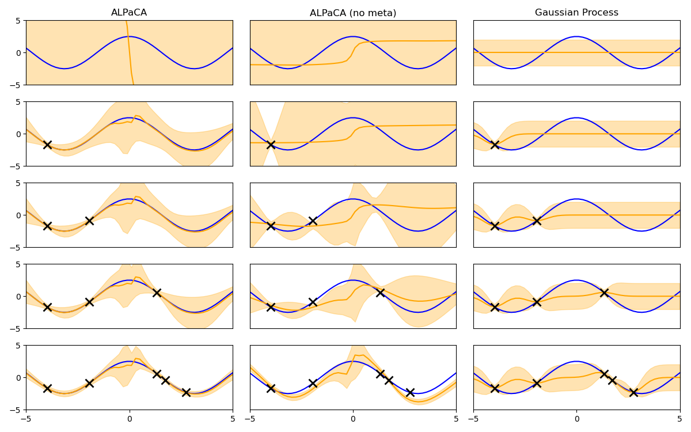

# Implementation of "Meta-Learning Priors for Efficient Online Bayesian Regression"

JAX implementation I made to understand GP's and meta-learning.

Find my blogpost [here](https://palafox.info/research/gps).

Read the paper [here](https://arxiv.org/abs/1807.08912).

Code should be pretty self-explanatory.

Example plot given by `test.py` meant to reproduces Figure 2 from the paper:

